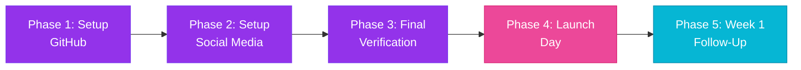

# 🚀 Stables: Master Launch Strategy

> **The Complete Step-by-Step Execution Plan**  
> **Created**: 2026-01-04  
> **Status**: Ready for Execution

---

## 📋 Executive Summary

You have **11 comprehensive launch documents** covering every aspect of your launch. This master strategy consolidates them into a **single, linear execution path** with clear timelines, dependencies, and decision points.

### What You're Launching

**Product**: Stables - A decentralized money platform built on Minima  
**Core Message**: "Money Platform"  
**Target Audience**: Minima community, DeFi users, privacy advocates, Stablescoin users

### Launch Assets Ready

✅ **9 Documentation Files** (strategy, content, checklists)  
✅ **4 Visual Assets** (X header, profile pic, symbol, presentation)  
✅ **1 Presentation** (3MB HTML, ready for GitHub Pages)  
✅ **Pre-written Content** (launch tweet, 8-tweet thread, Reddit/LinkedIn posts)

---

## 🎯 The 5-Phase Launch Strategy



---

## Phase 1: GitHub Infrastructure Setup

**Timeline**: 30-45 minutes  
**Dependencies**: None (start here)  
**Reference**: [`github/setup_guide.md`](file:///h:/My%20Drive/Stablesworks/1_development/github/setup_guide.md)

### Step 1.1: Create GitHub Organization (10 min)

1. **Navigate** to [github.com/organizations/new](https://github.com/organizations/new)
2. **Create organization**:
   - Organization name: `stables-council`
   - Contact email: Your email
   - Organization type: **Free**
3. **Configure profile**:
   - Name: `Stables`
   - Description: `Decentralized money platform built on Minima`
   - X: `@StablesCouncil` (will create in Phase 2)
4. **Upload profile picture**: `1_symbol_social.png` from `2_current/assets/`

**Verification**: Visit `https://github.com/stables-council` and confirm profile displays correctly.

---

### Step 1.2: Create Presentation Repository (15 min)

1. **Create repo**:
   - Go to `https://github.com/stables-council`
   - Click **"New repository"**
   - Repository name: `presentation`
   - Description: `Official Stables presentation`
   - Visibility: ✅ **Public**
   - Initialize with: ✅ README, ✅ MIT License
2. **Upload presentation**:
   - Click **"Add file"** → **"Upload files"**
   - Upload `Stablesworks _ the money platform.html` from `2_current/assets/`
   - **CRITICAL**: Rename to `index.html` during upload
   - Commit message: `Initial presentation upload`
3. **Update README**:
   - Click on `README.md` → Edit (pencil icon)
   - Replace content with [`github/presentation_readme.md`](file:///h:/My%20Drive/Stablesworks/1_development/github/presentation_readme.md)
   - Commit message: `Update README with project details`

**Verification**: Confirm `index.html` appears in the repository root.

---

### Step 1.3: Enable GitHub Pages (10 min)

1. **Navigate** to `https://github.com/stables-council/presentation`
2. **Settings** → **Pages** (left sidebar)
3. **Configure deployment**:
   - Source: **Deploy from a branch**
   - Branch: **main** + **/ (root)**
   - Click **Save**
4. **Wait 2-5 minutes** for deployment
5. **Test URL**: `https://stables-council.github.io/presentation`

**Verification Checklist**:
- [ ] Presentation loads without errors
- [ ] All slides are visible
- [ ] Images display correctly
- [ ] Animations work (if any)
- [ ] Mobile responsive (test on phone)

> [!CAUTION]
> **DO NOT PROCEED** until the GitHub Pages URL is verified. This URL goes in your launch tweet and cannot be changed after posting.

---

### Step 1.4: Prepare Console Repository (5 min)

**Note**: This is for Week 2, but create it now to keep the organization complete.

1. **Create repo**:
   - Repository name: `console`
   - Description: `User interface for Stables`
   - Visibility: 🔒 **Private** (will make public in Week 2)
   - Initialize with: ✅ README, ✅ MIT License, ✅ Node .gitignore
2. **Save for later**: You'll upload console code and make it public after Week 1.

---

## Phase 2: Social Media Profile Setup

**Timeline**: 20-30 minutes  
**Dependencies**: Phase 1 complete (need GitHub URL for bio)  
**Reference**: [`docs/social_profile_strategy_updated.md`](file:///h:/My%20Drive/Stablesworks/1_development/docs/social_profile_strategy_updated.md)

### Step 2.1: Create X/X Account (10 min)

1. **Create account**:
   - Handle: `@StablesCouncil` (or alternative if taken: `@Stables_Minima`, `@StablesOfficial`)
   - Display name: `Stables`
   - Email: Use a dedicated project email
   - Birth date: Required by X (use project start date)
2. **Configure profile**:
   - **Bio**: `Money Platform. Money that is truly yours. Secure. Pseudonymous. Unstoppable.`
   - **Location**: Leave blank or `Decentralized`
3. **Upload visual assets**:
   - **Profile picture**: `stables_X_pfp_final.png` from `2_current/assets/`
   - **Header image**: `stables_X_header_final.png` from `2_current/assets/`
4. **Enable analytics**:
   - Go to [analytics.X.com](https://analytics.X.com)
   - Enable analytics for tracking

**Verification**: View profile on desktop and mobile to confirm visuals display correctly.

---

### Step 2.2: Optional - LinkedIn Company Page (10 min)

**Skip this if you want to focus on X first.**

1. **Create page**:
   - Company name: `Stables`
   - Industry: `Financial Services` or `Blockchain`
   - Company size: `1-10 employees`

2. **Upload assets**:
   - Logo: `1_symbol_social.png`
   - Cover image: `stables_X_header_final.png` (may need to resize)
3. **Description**: Use professional version from [`launch_content_package.md`](file:///h:/My%20Drive/Stablesworks/1_development/docs/launch_content_package.md)

---

### Step 2.3: Update GitHub Organization (2 min)

Now that you have the X handle:

1. **Go to** `https://github.com/stables-council`
2. **Settings** → **Profile**
3. **Update X field**: `@StablesCouncil` (or your actual handle)
4. **Save**

---

## Phase 3: Content Preparation & Final Verification

**Timeline**: 20-30 minutes  
**Dependencies**: Phases 1 & 2 complete  
**Reference**: [`docs/launch_content_package.md`](file:///h:/My%20Drive/Stablesworks/1_development/docs/launch_content_package.md)

### Step 3.1: Finalize Launch Tweet (10 min)

**Decision Point**: Choose your hashtag strategy.

#### Option A (Recommended): Broad Reach
```
Stables is live.

A decentralized money platform built on Minima.

Money Platform.
The protocol is autonomous.
The Council is forming.

https://stables-council.github.io/presentation

#Stables #Minima #Stablescoins #FinancialSovereignty
```
**Character count**: 247/280 ✅  
**Rationale**: Targets multiple audiences (DeFi, Stablescoins, sovereignty advocates)

#### Option B: Focused & Simple
```
Stables is live.

A decentralized money platform built on Minima.

Money Platform.
The protocol is autonomous.
The Council is forming.

https://stables-council.github.io/presentation

#Stables #Minima #MoneyPlatform
```
**Character count**: 235/280 ✅  
**Rationale**: Cleaner, emphasizes brand positioning

**Action**:
1. Choose Option A or B
2. **CRITICAL**: Replace URL with your verified GitHub Pages link
3. Save as draft in X or in a text file
4. Triple-check for typos

---

### Step 3.2: Prepare Day 2 Thread (5 min)

The 8-tweet thread is pre-written in [`launch_content_package.md`](file:///h:/My%20Drive/Stablesworks/1_development/docs/launch_content_package.md).

**Action**:
1. Review the thread
2. Customize if needed (add specific features, adjust tone)
3. Save as draft or schedule for Day 2 (24 hours after launch)

---

### Step 3.3: Prepare Cross-Platform Posts (5 min)

**Reddit (r/Minima)**:
- Pre-written template in [`launch_content_package.md`](file:///h:/My%20Drive/Stablesworks/1_development/docs/launch_content_package.md)
- Customize with any Minima-specific context
- Save for Day 1 posting

**LinkedIn** (if created):
- Professional version in [`launch_content_package.md`](file:///h:/My%20Drive/Stablesworks/1_development/docs/launch_content_package.md)
- Adjust tone for corporate audience
- Save for Day 5

---

### Step 3.4: Final Verification Checklist (10 min)

**Links**:
- [ ] GitHub Pages URL works: `https://stables-council.github.io/presentation`
- [ ] X profile URL: `https://X.com/StablesCouncil`

**Content**:
- [ ] Launch tweet has correct URL
- [ ] No typos in launch tweet
- [ ] X bio is correct
- [ ] GitHub README files are accurate
- [ ] Hashtags are spelled correctly (e.g., `#FinancialSovereignty` not `#FinancialSovereignity`)

**Visuals**:
- [ ] X header displays correctly (desktop + mobile)
- [ ] X profile pic is clear and recognizable
- [ ] GitHub org profile picture shows
- [ ] Presentation HTML renders correctly

**Backup**:
- [ ] Save all content to a text file (in case X crashes)
- [ ] Screenshot your X profile (for records)
- [ ] Bookmark all important URLs

---

## Phase 4: Launch Day Execution

**Timeline**: 5 minutes + ongoing monitoring  
**Dependencies**: Phases 1-3 complete  
**Reference**: [`docs/launch_checklist.md`](file:///h:/My%20Drive/Stablesworks/1_development/docs/launch_checklist.md)

### Step 4.1: Choose Launch Time

**Recommended**: 9:00 AM UTC (adjust for your target audience)

**Rationale**:
- Catches European morning (10-11 AM CET)
- Catches US East Coast early morning (4-5 AM EST)
- Gives you a full day to monitor and engage

**Alternative**: 2:00 PM UTC (catches US morning, European afternoon)

---

### Step 4.2: Post Launch Tweet (2 min)

**T-0 (Launch Time)**:

1. **Copy** your finalized launch tweet
2. **Paste** into X
3. **Double-check** the URL one last time
4. **Post**
5. **IMMEDIATELY PIN THE TWEET**:
   - Click the three dots on the tweet
   - Select "Pin to your profile"

---

### Step 4.3: Cross-Post to Other Platforms (3 min)

**Within 5 minutes of X post**:

1. **Reddit** (r/Minima):
   - Post your pre-written Reddit version
   - Engage with comments immediately
2. **Minima Discord** (if applicable):
   - Share in appropriate channel
   - Add context for the community
3. **Minima Telegram** (if applicable):
   - Share with brief intro
4. **LinkedIn** (optional for Day 1):
   - Post professional version
   - Tag relevant connections

---

### Step 4.4: Monitor & Engage (Ongoing)

**First Hour** (Critical):
- [ ] Respond to every reply within 5 minutes
- [ ] Retweet positive reactions
- [ ] Answer questions thoroughly
- [ ] Thank early supporters

**Throughout Day 1** (9 AM - 9 PM):
- [ ] Check X every 30-60 minutes
- [ ] Monitor Reddit thread
- [ ] Track metrics (see Step 4.5)
- [ ] Engage authentically (no spam, no hype)

**Evening Check-in** (6:00 PM UTC):
- [ ] Reply to any unanswered questions
- [ ] Retweet top community reactions
- [ ] Note feedback for iteration
- [ ] Plan Day 2 adjustments if needed

---

### Step 4.5: Track Launch Metrics

**Real-Time Tracking** (use X Analytics):
- Launch tweet impressions
- Profile visits
- Link clicks (GitHub Pages)
- Follower growth
- Engagement rate (likes, retweets, replies)

**GitHub Tracking**:
- Presentation page views (if analytics enabled)
- Repository stars
- Repository forks

**Qualitative Metrics**:
- Sentiment in replies (positive/neutral/negative)
- Quality of questions (indicates genuine interest)
- Community-created content (memes, tutorials, etc.)

**Record in**: [`launch_checklist.md`](file:///h:/My%20Drive/Stablesworks/1_development/docs/launch_checklist.md) (Success Metrics section)

---

## Phase 5: Week 1 Follow-Up Strategy

**Timeline**: Days 2-7  
**Dependencies**: Phase 4 complete  
**Reference**: [`docs/launch_content_package.md`](file:///h:/My%20Drive/Stablesworks/1_development/docs/launch_content_package.md)

### Day-by-Day Content Calendar

| Day | Content | Hashtags | Goal |
|:---|:---|:---|:---|
| **Day 1** | Launch tweet (pinned) | `#Stables #Minima #Stablescoins #FinancialSovereignty` | Awareness |
| **Day 2** | X thread (8 tweets) | `#Stables #Minima` | Education |
| **Day 3** | Tutorial: "How to mint Stables" | `#Stables #Minima #DeFi` | Onboarding |
| **Day 4** | "Why pseudonymity matters" | `#Stables #FinancialSovereignty` | Values |
| **Day 5** | LinkedIn post | `#DeFi #Blockchain #Stablescoins` | Professional reach |
| **Day 6** | Console feature highlight | `#Stables #Minima` | Product showcase |
| **Day 7** | Week 1 recap + thank you | `#Stables #Minima` | Community building |

---

### Day 2: X Thread (24 hours after launch)

**Pre-written thread** in [`launch_content_package.md`](file:///h:/My%20Drive/Stablesworks/1_development/docs/launch_content_package.md).

**Action**:
1. Post the 8-tweet thread
2. Monitor engagement on each tweet
3. Respond to thread replies
4. Retweet insightful responses

**Hashtags**: Use `#Stables #Minima` on the first tweet only.

---

### Day 3: Tutorial Content

**Content Idea**: "How to mint your first Stables"

**Format**:
- Step-by-step guide (text + screenshots)
- Or short video walkthrough
- Link to presentation for context

**Hashtags**: `#Stables #Minima #DeFi`

---

### Day 4: Values & Philosophy

**Content Idea**: "Why pseudonymity matters in finance"

**Format**:
- Short essay (X thread or single tweet)
- Emphasize "money that is truly yours"
- Connect to broader privacy movement

**Hashtags**: `#Stables #FinancialSovereignty`

---

### Day 5: LinkedIn Professional Post

**Content**: Professional version from [`launch_content_package.md`](file:///h:/My%20Drive/Stablesworks/1_development/docs/launch_content_package.md)

**Tone**: More formal, emphasize innovation and technical achievement

**Hashtags**: `#DeFi #Blockchain #Stablescoins`

---

### Day 6: Console Feature Highlight

**Content**: Screenshot or demo of the console

**Format**:
- Visual showcase
- Highlight key feature (e.g., "Mint Stables in 3 clicks")
- Tease upcoming features

**Hashtags**: `#Stables #Minima`

---

### Day 7: Week 1 Recap

**Content**: Thank the community + share metrics (if positive)

**Format**:
```
Week 1 of Stables is complete.

Thank you to everyone who:
- Joined the community
- Asked questions
- Shared feedback
- Minted their first Stables

This is just the beginning.

#Stables #Minima
```

**Include metrics** (if impressive):
- Followers gained
- Presentation views
- GitHub stars

---

## 🚨 Contingency Plans

### If GitHub Pages Doesn't Deploy

**Backup Option**: Use Google Drive public link

1. Upload `Stablesworks _ the money platform.html` to Google Drive
2. Set sharing to "Anyone with link can view"
3. Use Drive link in launch tweet
4. **Note**: This is less professional, so troubleshoot GitHub first

**Troubleshooting GitHub Pages**:
- Verify file is named `index.html`
- Check Settings → Pages is enabled
- Wait 5-10 minutes (sometimes takes longer)
- Check "Actions" tab for deployment errors

---

### If X Handle is Taken

**Alternatives** (in order of preference):
1. `@Stables_Minima`
2. `@StablesOfficial`
3. `@Stables_Minima`
4. `@StablesOfficial`

**Action**: Update all references in launch materials.

---

### If Launch Tweet Gets Low Engagement

**Don't Panic**: Day 1 metrics aren't everything.

**Actions**:
1. Retweet from personal account (if applicable)
2. Ask Minima team to share (if relationship exists)
3. Post in Minima community channels
4. Focus on quality engagement, not quantity
5. Continue with Day 2-7 content plan

**Remember**: Building a community takes time.

---

## 📊 Success Metrics & Goals

### Week 1 Targets (Adjust based on your expectations)

**Quantitative**:
- X followers: 50-100 (realistic for niche DeFi project)
- Launch tweet impressions: 1,000-5,000
- GitHub stars: 10-25
- Presentation page views: 200-500

**Qualitative** (More Important):
- Positive sentiment in replies
- Thoughtful questions about the protocol
- Community-created content (memes, tutorials)
- Recognition from Minima community
- Developer interest (GitHub issues, PRs)

**Track in**: [`launch_checklist.md`](file:///h:/My%20Drive/Stablesworks/1_development/docs/launch_checklist.md)

---

## 📁 Quick Reference: All Launch Files

### Documentation (in `1_development/docs/`)

| File | Purpose |
|:---|:---|
| [`launch_package_quickstart.md`](file:///h:/My%20Drive/Stablesworks/1_development/docs/launch_package_quickstart.md) | Quick start guide (START HERE) |
| [`launch_content_package.md`](file:///h:/My%20Drive/Stablesworks/1_development/docs/launch_content_package.md) | All social media content |
| [`launch_checklist.md`](file:///h:/My%20Drive/Stablesworks/1_development/docs/launch_checklist.md) | Execution checklist |
| [`hashtag_strategy.md`](file:///h:/My%20Drive/Stablesworks/1_development/docs/hashtag_strategy.md) | Hashtag guidelines |
| [`launch_strategy_analysis.md`](file:///h:/My%20Drive/Stablesworks/1_development/docs/launch_strategy_analysis.md) | Strategic rationale |
| [`social_profile_strategy_updated.md`](file:///h:/My%20Drive/Stablesworks/1_development/docs/social_profile_strategy_updated.md) | Profile configuration |
| [`launch_summary.md`](file:///h:/My%20Drive/Stablesworks/1_development/docs/launch_summary.md) | High-level summary |

### GitHub Setup (in `1_development/github/`)

| File | Purpose |
|:---|:---|
| [`setup_guide.md`](file:///h:/My%20Drive/Stablesworks/1_development/github/setup_guide.md) | GitHub step-by-step instructions |
| [`presentation_readme.md`](file:///h:/My%20Drive/Stablesworks/1_development/github/presentation_readme.md) | README for presentation repo |
| [`console_readme.md`](file:///h:/My%20Drive/Stablesworks/1_development/github/console_readme.md) | README for console repo (Week 2) |

### Visual Assets (in `2_current/assets/`)

| File | Purpose |
|:---|:---|
| `stables_X_header_final.png` | X header (1500x500) |
| `stables_X_pfp_final.png` | X profile picture (400x400) |
| `1_symbol_social.png` | GitHub org profile picture |
| `Stablesworks _ the money platform.html` | Presentation source (3MB) |

---

## ✅ Pre-Launch Final Sign-Off

**Before you click "Post", confirm**:

- [ ] I have verified the GitHub Pages URL works
- [ ] I have tested all links in the launch tweet
- [ ] I have reviewed all content for typos
- [ ] I have chosen my hashtag strategy (Option A or B)
- [ ] I have uploaded all visual assets to X
- [ ] I have saved a backup copy of all content
- [ ] I am ready to monitor and engage for the next 24 hours
- [ ] I understand that launch is just the beginning

**Signature**: _________________ **Date**: _________________

---

## 🎯 The Launch Mindset

> [!IMPORTANT]
> **Remember These Principles**:
> 
> 1. **Launch is just the beginning** - The real work is building community
> 2. **Quality over quantity** - 10 engaged users > 100 passive followers
> 3. **Authenticity wins** - Be genuine, not hype-driven
> 4. **Iterate based on feedback** - Listen to your community
> 5. **Build in public** - Share your journey, wins, and challenges
> 6. **Patience** - Overnight success is a myth

**Money Platform.**

Good luck! 🚀

---

## 🆘 Need Help During Launch?

**Troubleshooting**:
- GitHub Pages issues → [`github/setup_guide.md`](file:///h:/My%20Drive/Stablesworks/1_development/github/setup_guide.md) (Troubleshooting section)
- Low engagement → [`launch_checklist.md`](file:///h:/My%20Drive/Stablesworks/1_development/docs/launch_checklist.md) (Contingency Plans)
- Hashtag questions → [`hashtag_strategy.md`](file:///h:/My%20Drive/Stablesworks/1_development/docs/hashtag_strategy.md)

**Quick Decisions**:
- Hashtag choice → Option A (recommended for broader reach)
- Launch time → 9:00 AM UTC (catches multiple time zones)
- Day 1 focus → X + Reddit (save LinkedIn for Day 5)

---

**Last Updated**: 2026-01-04  
**Next Review**: After Week 1 (analyze metrics and adjust Week 2 strategy)


